# 🌿 Panchkarma – Ayurvedic Therapy & Appointment System

## 📌 Description

Panchkarma is a modern Ayurvedic healthcare web application where users can **register, log in, and get AI-based therapy suggestions** or manually explore therapies.
Users can then **choose from multiple therapy options, view available doctors, and book appointments online.**

The platform also includes an **interactive dashboard with graphs and analytics** for doctors/admins to manage therapies, patients, and appointments.

---

## 🚀 Features

### 👤 User Features

* Secure **registration & login** (JWT/Session-based authentication)
* **AI-powered therapy suggestions** based on symptoms or preferences
* Explore **detailed therapy catalog** (Vamana, Virechana, Basti, Nasya, Raktamokshana, and more)
* **Doctor availability check** and appointment booking system
* Personalized **user dashboard** with appointment history

### 🩺 Doctor/Admin Features

* Doctor profile management (specialization, availability, etc.)
* Appointment management system
* **Dashboard with graphs**:

  * Number of patients per therapy
  * Popular therapies
  * Appointment statistics
  * Revenue insights

### ⚡ Technical Features

* Role-based access (User / Doctor / Admin)
* AI therapy recommendation system (ML/NLP or rule-based engine)
* Responsive UI with **amazing dashboards & charts**
* Secure backend with data validation & encryption

---

## 🛠 Tech Stack

* **Frontend:** React (with Tailwind CSS / Chart.js / Recharts)
* **Backend:** Node.js + Express
* **Database:** MongoDB / PostgreSQL
* **Authentication:** JWT / OAuth
* **AI Engine:** Gemini Api
* **Charts & Graphs:** Recharts / Chart.js


---

## ⚙️ Installation

Clone the repository:

```bash
git clone https://github.com/your-username/panchkarma.git
cd panchkarma
```

Install dependencies:

```bash
npm install
```

Run the backend server:

```bash
npm run server
```

Run the frontend:

```bash
npm run dev
```

---

## 📸 Screenshots & Demo

(Add images or GIFs of your UI – login, therapy selection, doctor booking, dashboard)

#Login

<p align="center"> 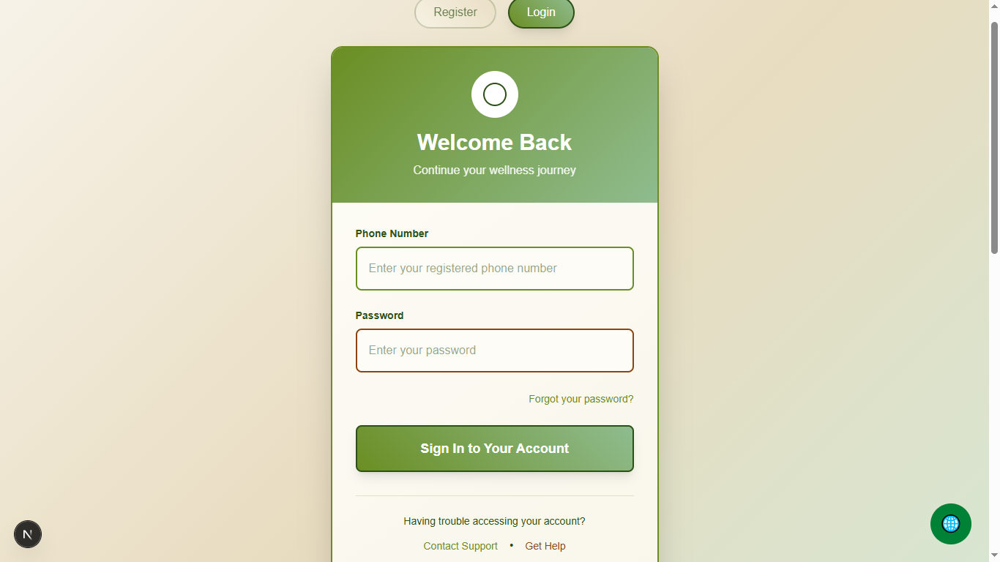 </p> <p align="center">  </p> <p align="center"> 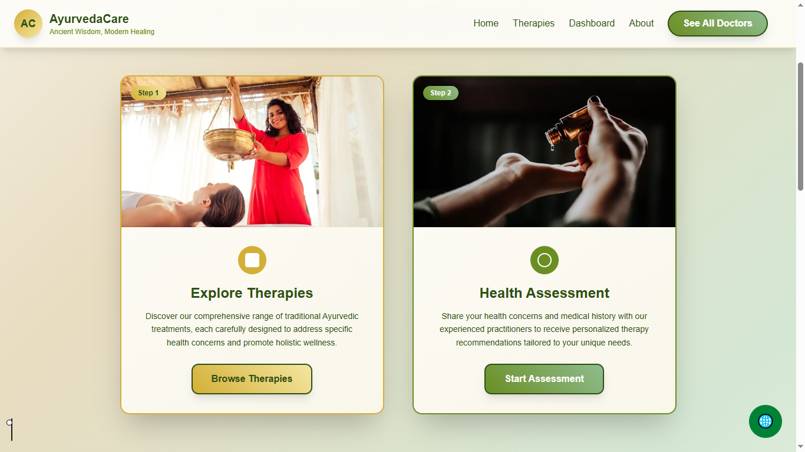 </p> <p align="center"> 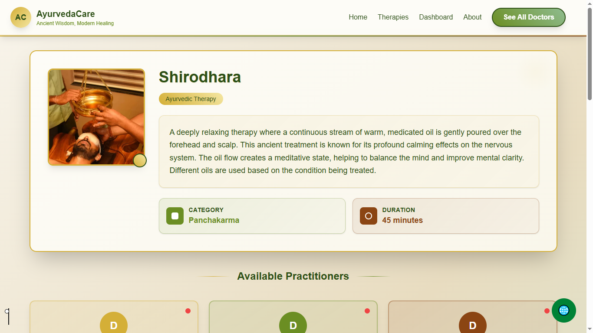 </p> <p align="center"> 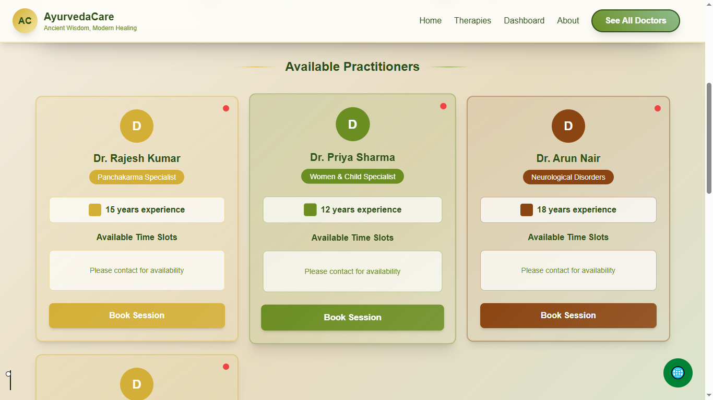 </p> <p align="center"> 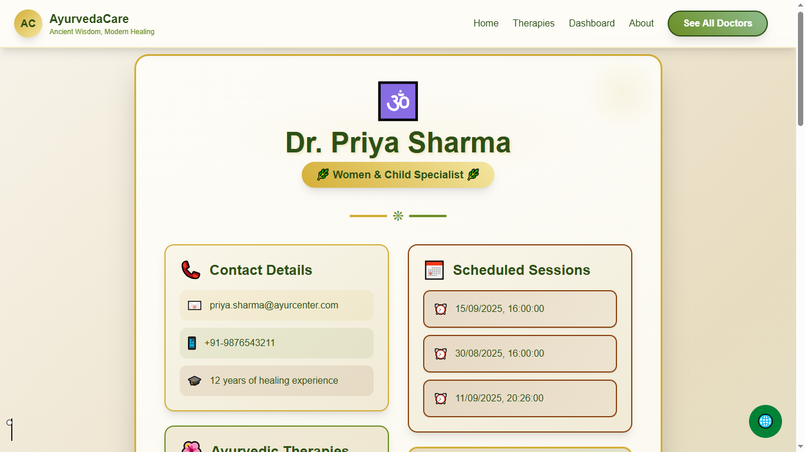 </p> <p align="center"> 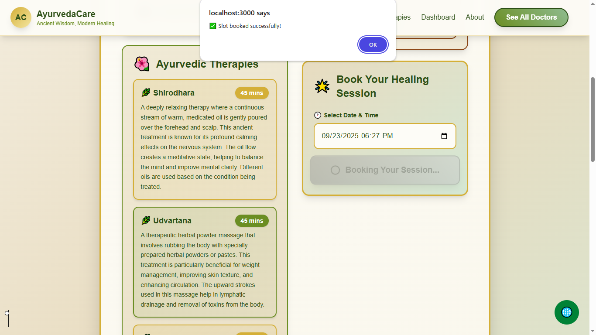 </p> <p align="center"> 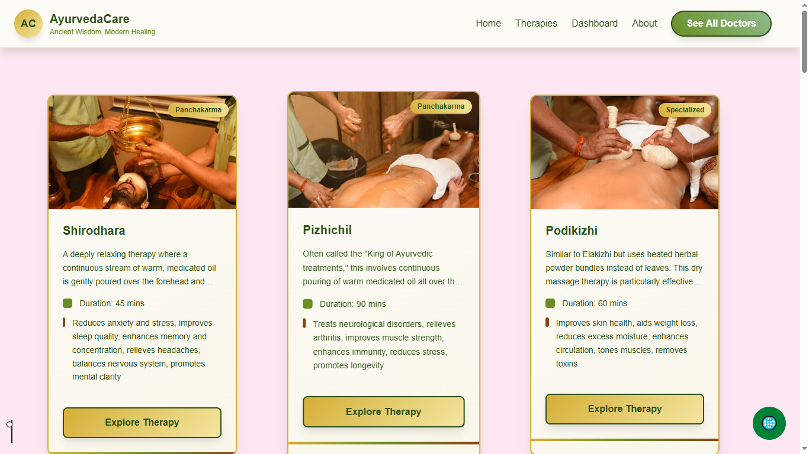 </p> <p align="center"> 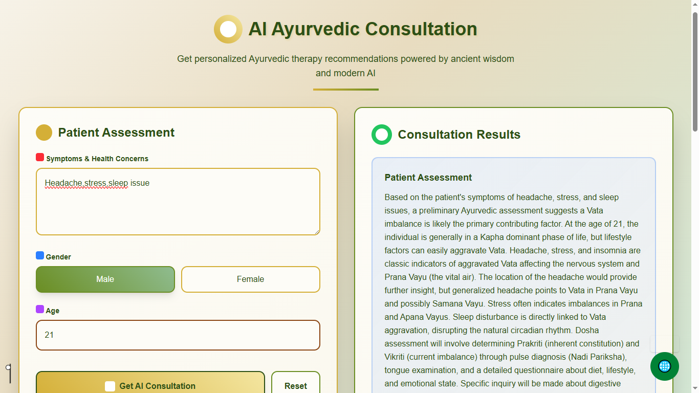 </p> <p align="center"> 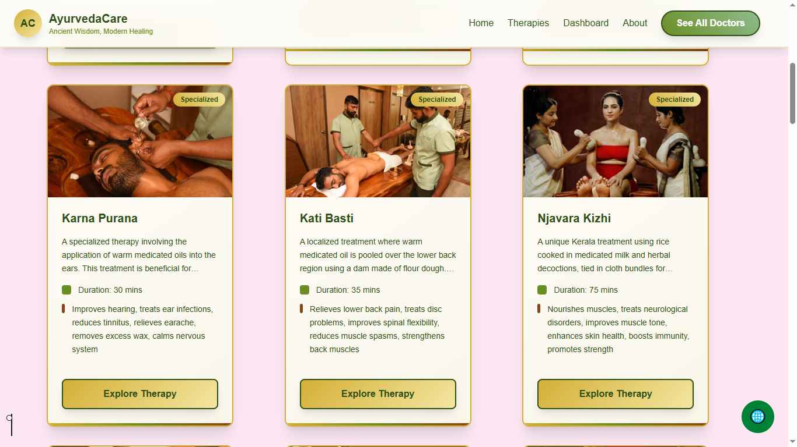 </p> <p align="center"> 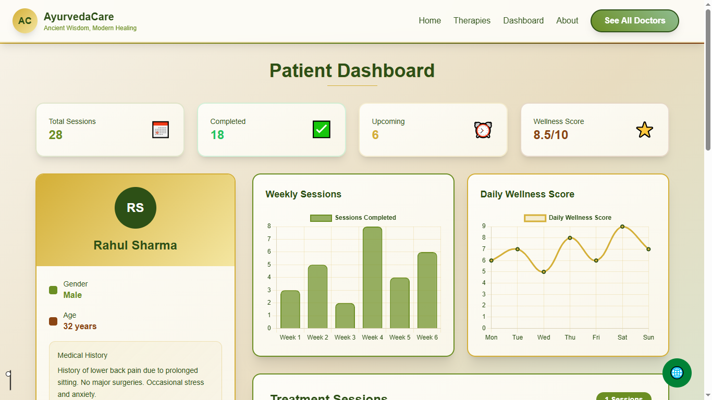 </p> <p align="center"> 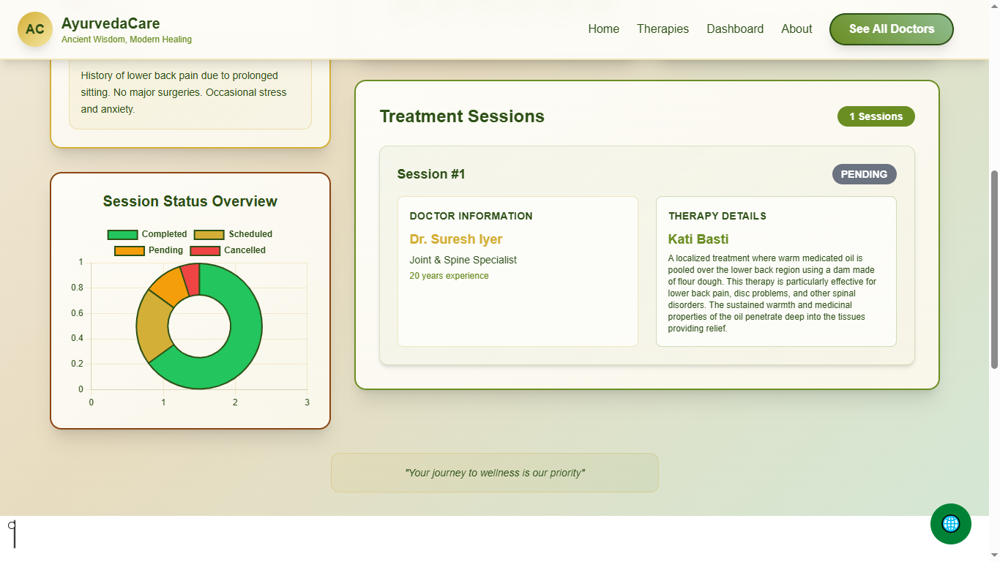 </p>

## 📖 Usage

1. **Sign up / Log in**
2. Enter your health preferences/symptoms → Get **AI therapy suggestions**
3. Browse therapies manually if you prefer
4. Select a therapy → Choose an available doctor
5. Book an appointment
6. Access your dashboard → Track progress, view analytics

---

## 🤝 Contributing

Contributions, issues, and feature requests are welcome!

* Fork the repo
* Create a feature branch
* Submit a pull request

---

## 📜 License

This project is licensed under the MIT License.
